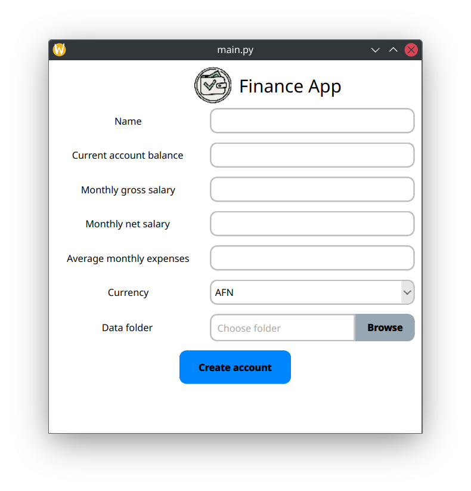
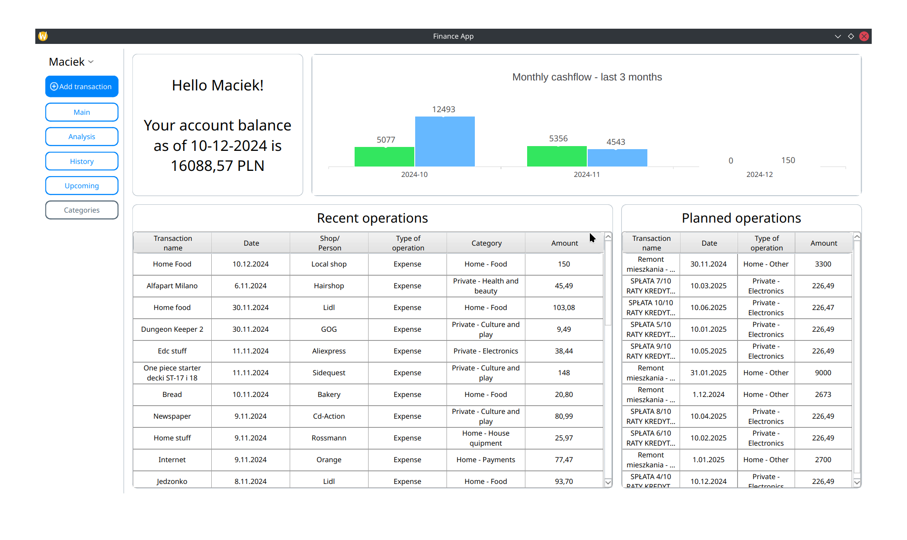
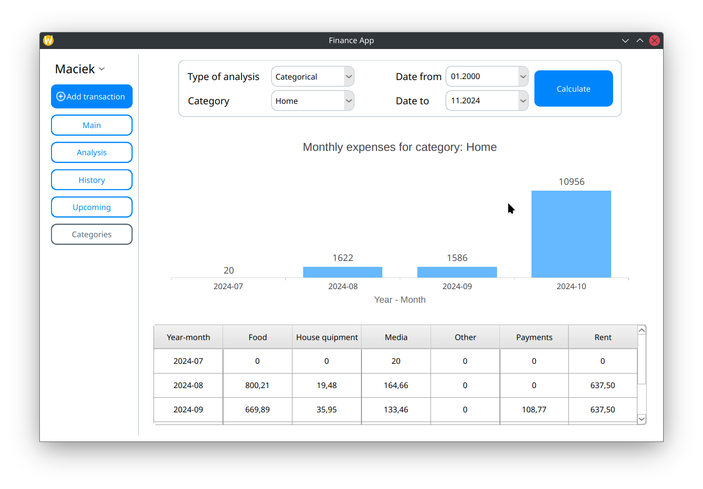
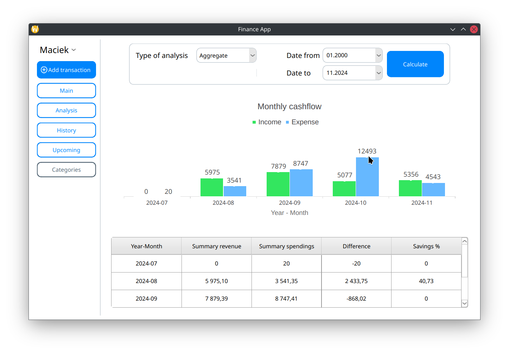
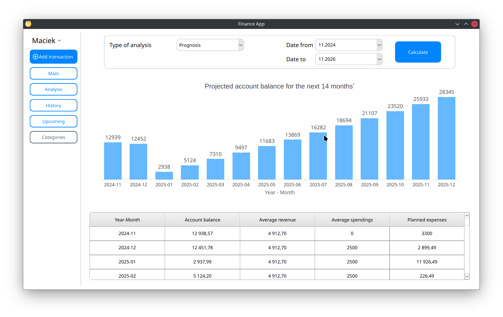
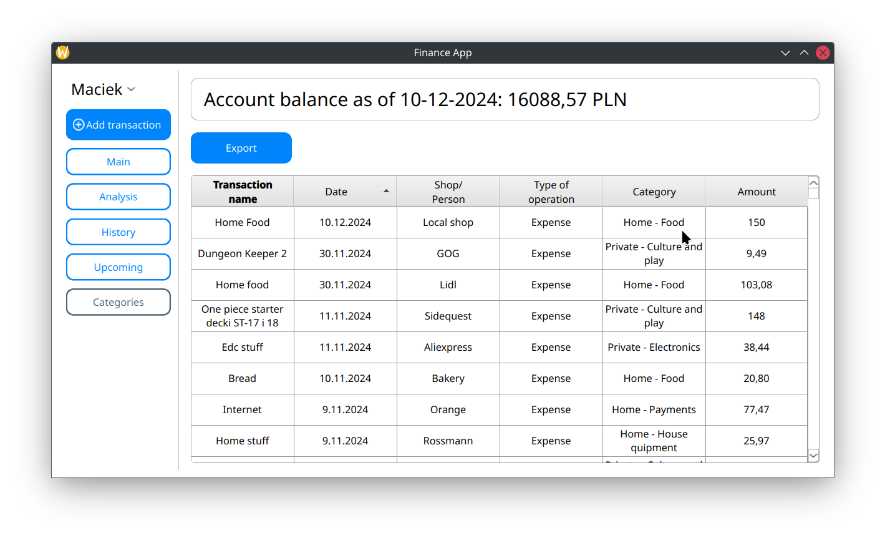
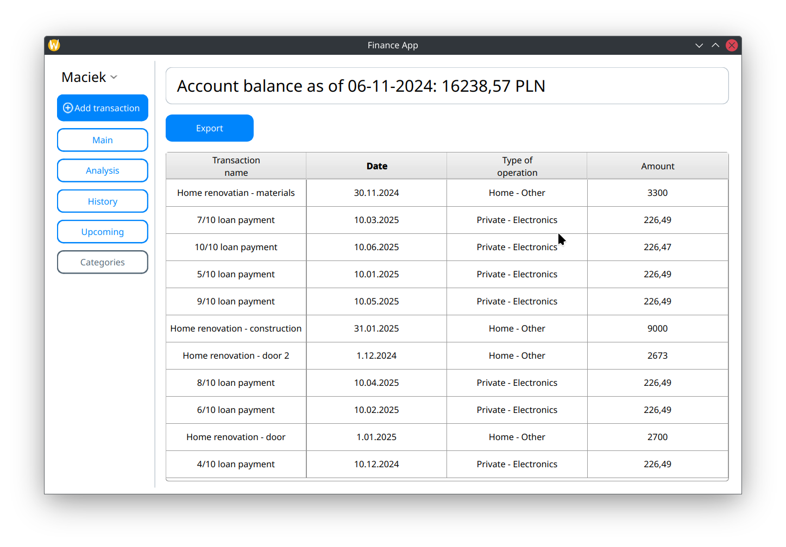
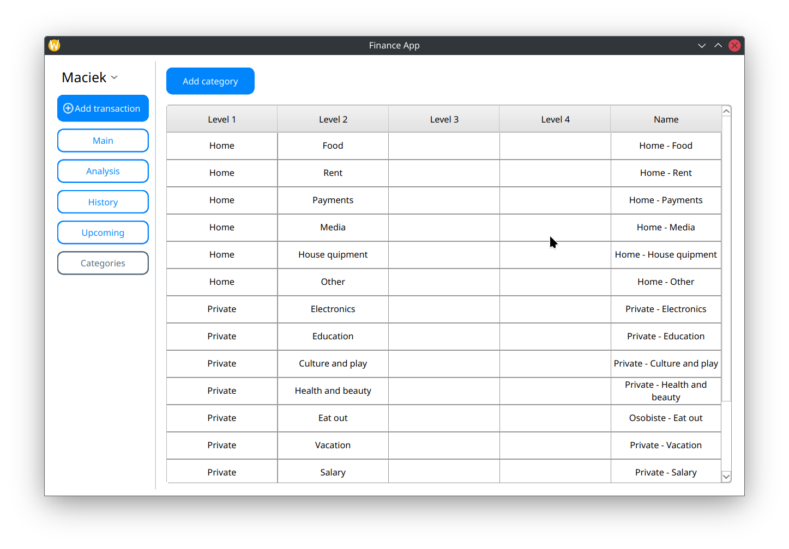

# FinanList

## Overview

This is a Python-based personal finance management application designed to help users take control of their finances. The app provides features for categorizing operations, tracking expenses and income, analyzing cashflow, and planning for the future. It is a tool aimed at improving financial awareness and decision-making.

---

## Features

* **Custom Categories** :
  * Create personalized operation categories to organize transactions.
* **Add operations** :
  * Add transactions with information such as name, operation date, seller, amount and type:
    * Expense
    * Income
    * Upcoming (planned operation)
* **Monthly Analysis** :
  * Generate cashflow tables for a specific month.
  * Create charts to visualize income and expenses by category.
* **Summaries** :
  * Get a comprehensive summary of your financial status.
  * Analyze trends and make informed decisions.
* **Prognosis** :
  * Predict future account balance based on personal income, average sepndings and future transactions.
* **Export** :
  * Export all transactions to a file for external use.

---

## Installation

1. Clone the repository:
   ```bash
   git clone https://github.com/PilgrimMatthias/FinanList.git
   cd FinanList
   ```
2. Ensure you have Python installed (>=3.8).
3. Install the required packages:
   ```bash
   pip install -r requirements.txt
   ```

---

## Usage

1. Run the application:
   ```bash
   python main.py
   ```
2. Use the intuitive UI to:
   * Create categories.
   * Add and manage transactions.
   * View financial summaries and charts.
   * Export your data.

## Screenshots

### Sign in



### Main



### Analysis







### History



### Upcoming



### Categories



## Contributing

Contributions are welcome! Please:

1. Fork this repository.
2. Create a new branch for your feature or bug fix.
3. Submit a pull request with a detailed description of changes.

---

## License

This project is licensed under the MIT License. See the `LICENSE` file for details.
